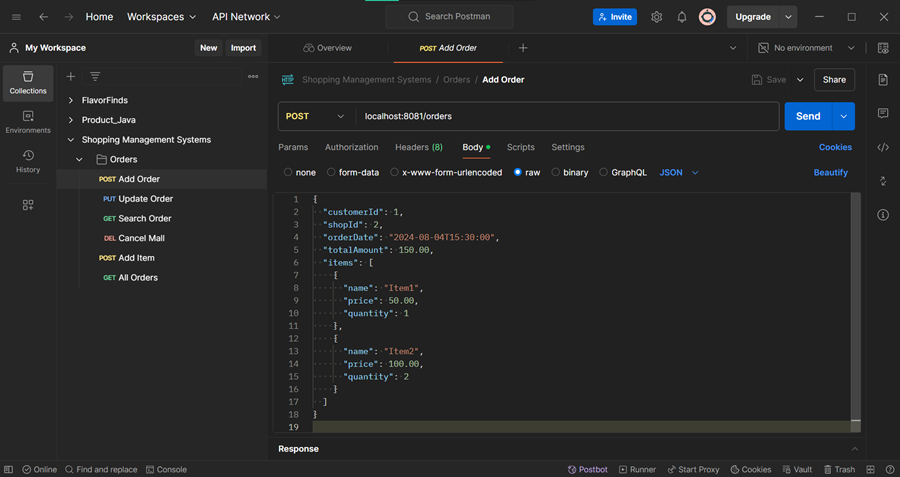
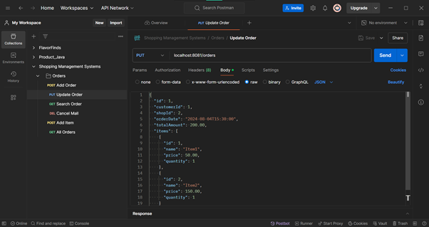
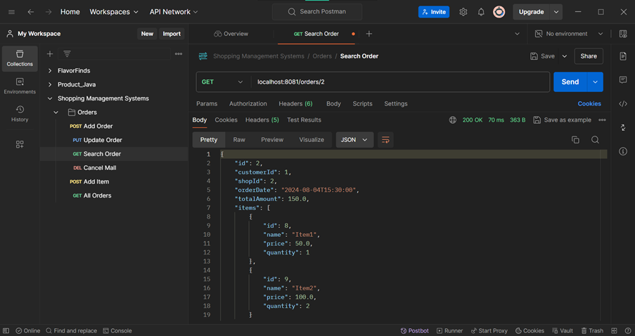
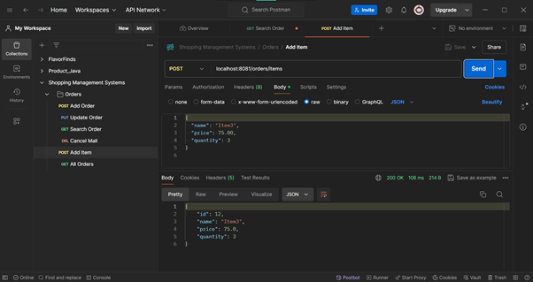
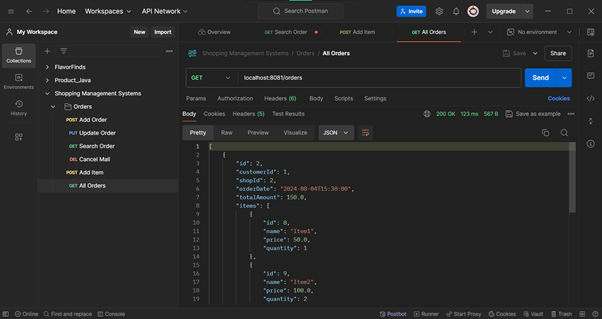

# Shopping Mall Management System

## Project Description
This project is a Shopping Mall Management System developed using Spring Boot. It manages orders, items, and customer interactions within a mall environment, providing RESTful services for operations such as adding, updating, searching, and canceling orders, as well as managing items.

## Table of Contents
- [Project Title](#shopping-mall-management-system)
- [Project Description](#project-description)
- [Table of Contents](#table-of-contents)
- [Features](#features)
- [Project Structure](#project-structure)
- [Setup and Installation](#setup-and-installation)
- [Configuration](#configuration)
- [Usage](#usage)
- [Project Flow](#project-flow)
- [API Endpoints](#api-endpoints)
- [Testing](#testing)
- [Images](#images)

## Features
- Manage orders within the shopping mall.
- Manage items available in different shops.
- RESTful API for CRUD operations on orders and items.
- Secure and efficient data handling using Spring Data JPA and MySQL.

## Project Structure
in.ac.jssateb.mallmanagement/ 
├── controller/ 
├── model/ 
├── repository/ 
├── service/ 
|── ShoppingMallManagementSystemApplication.java

- **controller/**: Contains REST controllers.
- **model/**: Contains entity classes.
- **repository/**: Contains repository interfaces.
- **service/**: Contains service interfaces and implementations.
- **ShoppingMallManagementSystemApplication.java**: Main application class.

## Setup and Installation
1. **Clone the repository:**
   ```bash
   git clone https://github.com/yourusername/ShoppingMallManagementSystem.git
2. **Navigate to the project directory:**
   ```bash
   cd ShoppingMallManagementSystem
3. **Build the project using Maven:**
   ```bash
   mvn clean install
4. **Run the application:**
   ```bash
   mvn spring-boot:run
## Configuration
Configure the application by setting the following properties in application.properties:
   ```bash
   spring.datasource.url=jdbc:mysql://localhost:3306/mall_database
   spring.datasource.username=root
   spring.datasource.password=yourpassword
   server.port=8081
```

## Usage:
Access the API using Postman or other REST clients. Below are some examples of the available endpoints.

## Project Flow:


## Testing:
Run the application and test the endpoints using Postman. Below are sample images showing the Postman test results:

- Sample Postman output:







